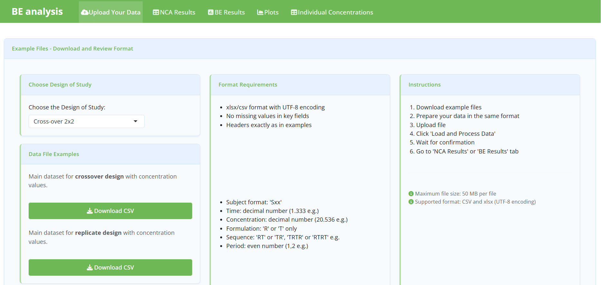

# R Shiny Application for Bioequivalence Analysis

## Overview

An interactive **R Shiny application for pharmacokinetic and statistical analysis of bioequivalence (BE) studies**.



The application was developed to support the analysis of pharmacokinetic (PK) data from crossover and replicate-design bioequivalence studies.

## Features

### Study designs

The application supports:

* **2×2 crossover studies**
* **Replicate designs**, including:

  * 2×2×4
  * 2×2×3
  * 2×3×3

The available study designs are implemented directly in the application interface.

### Pharmacokinetic analysis

The application performs non-compartmental analysis (NCA) of concentration–time data and calculates key PK parameters, including:

* Cmax
* Tmax
* Clast
* Tlast
* Clastp
* λz
* half-life (t½)
* AUClast
* AUC0-∞

The NCA calculations are implemented using the `NonCompart` package.

### Bioequivalence analysis

The application performs statistical analysis of bioequivalence using:

* ANOVA-based models
* sequence effects
* period effects
* treatment/formulation effects
* subject nested within sequence
* point estimate / geometric mean ratio
* confidence intervals
* intra-subject variability
* statistical power

For conventional 2×2 crossover studies, the model is based on the logarithmically transformed PK parameter and includes sequence, subject nested within sequence, period and formulation effects.

For replicate studies, the application implements analysis based on the EMA Method A framework and provides estimates of within-subject variability for reference and test formulations.

### Data visualization

The application provides:

* individual concentration-time profiles
* mean concentration-time profiles
* overlay plots

All plots can be transformed in logarithmic concentration-time scale. The application also allows users to download generated figures as PNG files.

### Results and export

Results are presented as interactive tables using `DT`, with options for copying and exporting results.

The application provides separate outputs for:

* NCA results
* individual PK concentration tables
* descriptive statistics
* bioequivalence analysis (estimate, CI, ANOVA, CV, Power)


## Input Data

The application accepts `.csv` and `.xlsx` datasets.

Example datasets are provided in the application and can be downloaded directly from the interface.

### Required variables

For concentration–time data, the main variables include:

| Variable        | Description                   |
| --------------- | ----------------------------- |
| `Subject`       | Study subject identifier      |
| `Sequence`      | Treatment sequence            |
| `Period`        | Study period                  |
| `Formulation`   | Test (`T`) or Reference (`R`) |
| `Time`          | Sampling time                 |
| `Concentration` | Measured drug concentration   |

The application expects specific formats for these variables, including `R`/`T` formulation coding and sequence identifiers such as `RT`, `TR`, `TRTR` and `RTRT`.

## Example Workflow

1. Select the study design.
2. Download an example dataset.
3. Prepare the study dataset according to the required format.
4. Upload the dataset.
5. Process the data.
6. Review NCA results.
7. Review statistical bioequivalence results.
8. Explore concentration-time profiles.
9. Export tables and figures.

The application provides these instructions directly in the user interface.

## Technologies

The application was developed in **R** using:

* [Shiny](https://shiny.posit.co/)
* [bslib](https://rstudio.github.io/bslib/)
* [tidyverse](https://www.tidyverse.org/)
* [NonCompart](https://cran.r-project.org/package=NonCompart)
* [sasLM](https://cran.r-project.org/package=sasLM)
* [PowerTOST](https://cran.r-project.org/package=PowerTOST)
* [DT](https://cran.r-project.org/package=DT)
* [readxl](https://cran.r-project.org/package=readxl)
* [shinyWidgets](https://cran.r-project.org/package=shinyWidgets)

## Project Structure

```text
r-shiny-bioequivalence-analysis/
│
├── app.R
├── functions.R
├── README.md
├── renv.lock
│
├── data/
│   └── example/
│       ├── data_example_cross.csv
│       └── data_example_replicate.csv
│
└── screenshots/
│       ├── be-results.png
│       └── concentration-data.png
│       └── nca-results.png
│       └── plots_1.png
│       └── plots_2.png
│       └── plots_3.png
│       └── upload_1.png
│       └── upload_2.png
```

## Reproducibility

The project uses [`renv`](https://rstudio.github.io/renv/) to record the R package environment.

To restore the project environment:

```r
install.packages("renv")
renv::restore()
```

Then run:

```r
shiny::runApp()
```

## Intended Use

This application is intended as a **research and analytical tool for pharmacokinetic and bioequivalence data analysis**.

It is not intended to replace validated statistical software, regulatory review, or qualified statistical assessment in regulatory submissions.

## Development

**Developer:** Darya Rylko
**Institution:** National Anti-Doping Laboratory, Belarus
**Year:** 2026

## License

This repository is provided for research and educational purposes.

Please contact the author before using the software for regulatory, clinical, or commercial purposes.

